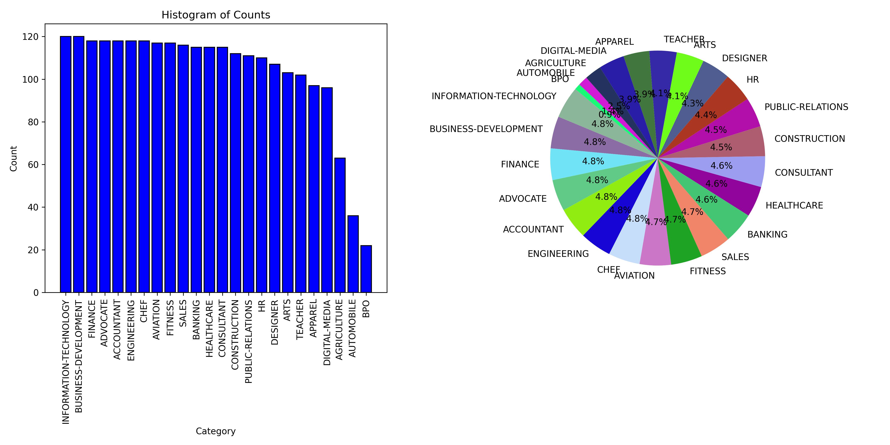
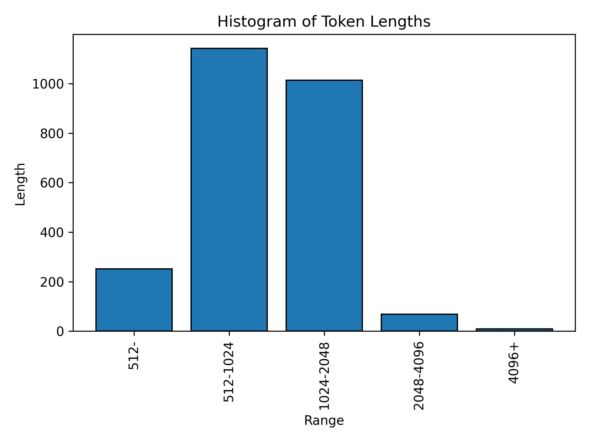
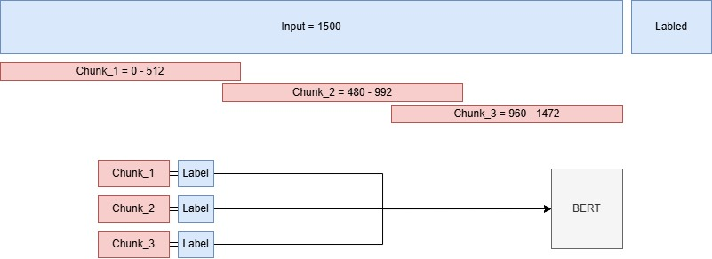
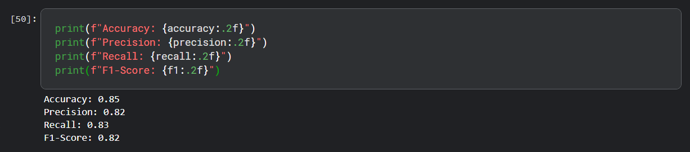

# Resume Classification

Welcome to Resume Classification. It's a Language model (BERT) that can correctly classify 24 differect category of resumes. 

## Project Structure

```bash
/Resume-Classification
    /dataset [Needs to be Downloaded]
        /data/...
        /Resume
            /Resume.csv
    /figures
        lables_distribution.jpg
        token_length_distribution.jpg
        data_processing_diagram.jpg
        performance.jpg
    /model_final_csv_classifier [Needs to be Downloded or trained]
    config.py
    data_processing.py
    environment.yml
    labels_mapping.pkl
    categorized_resume.csv
    readme.md
    script.py
    train.py
```

## Table of Contents

- Introduction
- Installation
- Data Preprocess
- Trainning
- Evaluation
- Inference / Script


## Introduction

Resume Classification is a machine learning model. The Bidirectional Encoder Representations from Transformers (BERT) is finetuned on custom dataset using a library [Belt-NLP](https://github.com/mim-solutions/bert_for_longer_texts). After training, given a CSV file the model extract texts from it. Then it chunks the text in size 514 and use each chunk separately for inferrence. After passing every chunk the model decides which class the resume belongs to. The chunking and tokenization is handled by Belt-NLP.

## Installation

### Step 1: Clone Repository

At first clone this repository using the following command

```bash
sudo apt install git-all
git clone https://github.com/Hujaifa-Git/Resume-Classification.git
```

### Step 2: Install Conda

To get started, you need to set up the Conda environment. If you haven't already, install Conda from the [official Anaconda website](https://www.anaconda.com/products/distribution) and follow the installation instructions.

### Step 3: Create the Conda environment

Once Conda is installed, create a new environment named `cv` using the provided `.yml` file and activate that environment:

```bash
conda env create -f environment.yml
conda activate cv
```

### Step 4: Download and Extract Dataset

Download dataset from this [Link](https://drive.google.com/file/d/1S_QL3ELp1scyBIxGg52iuxBjeO1UAyRV/view). After downloding unzip it into the main directory and set appropriate paths in 'config.py'

### Step 5: Finetuned Model Download [Optional]

If you don't want to train from scratch then you can download my finedtuned version from [Google Drive](https://drive.google.com/file/d/1AL4-xOmiJE4w2dUr50-otqxtZqx3HWHr/view?usp=sharing). After downloading extract the model and set it's path to config.py

```python
model_dir = 'model_final_csv_classifier'
```
If you do that you can directly start Evalution or Inference.


## Data Preprocess

Before training, the resume data needs to be preprocessed and analyzed. This script analyze the Category of resume available by creating a Chart (Bar and Pie) and Encodes the Categories into a numrical value. You can change the paths of dataset and saved graphs in 'config.py'.

```python
resume_dir = 'G:\Backup\dataset\Resume\Resume.csv'
figure_dir = 'figures/lables_distribution.jpg'
train_data_dir = 'train_data'
test_data_dir = 'test_data'
lable_mapping_dir = 'labels_mapping.pkl'
```
 After preprocessing it converts the DataFrame into a Huggingface Dataset, split into train-test and finally saves it locally. It also stores a lable_mapping that can be used later to convert the numerical values back into Categories. Finally it tokenize the resumes and create a chart demonstrating the lenght range of the dataset.

 

 

 To run this script simply do the following command

 ```bash
 python data_processing.py
 ```

After running you'll see and save 2 graphs. Train-test dataset and label_mapping dictionary will also be saved.

*Chunking and Tokenization is not done in this step. They are handled by Belt-NLP Library*

## Trainning

For Training [BERT](https://huggingface.co/google-bert/bert-base-uncased) is used. It is a Bidirectional Encoder Model developed by Google which is smaller compared to other Language Models and have a good performance. The only disadvantage is the context lenght of BERt is 512. From the above figure we can see most of the resumes have length more than 512. For that reason the input needs to be chnuked before passing to the model.



This Chunking and Tokenization is handled by Belt-NLP. You can change the parameters of chunking in 'config.py'

```python
MODEL_PARAMS = {
        "num_labels": 24,
        "batch_size": 16,
        "learning_rate": 5e-5,
        "epochs": 1,
        "chunk_size": 510, #Each Chunk Size
        "stride": 480, #Offset after each chunk
        "minimal_chunk_length": 128,
        "maximal_text_length": 510 * 4,
        "pooling_strategy": "mean",
        "device": device,
        "many_gpus": True,
    }

model_dir = 'model'
```

Chunk Size is 510 not 512 because 2 extra token is needed for each chunk to be added on the start and end. These are the starting and ending tokens. Stride is less than chunk size to allow some overlapping. This ensures every chunk has complete information. any chunk size less than 128 will be disgarded.

The Belt-NLP library's training module doesn't provide any logging so evaluation is done after training. You can start training by running the following command

```bash
python train.py
```

After running the final model will be saved in 'model_dir'

## Evaluation
To evaluate the trained model you need to load it and infer using the test dataset. Run the following command to evaluate your model
```bash
python evaluation.py
```
This script will print accuaracy, recall, precision and F1 score of the given model



This is the performance of my model after only 3 epoch of training. Due to lack of GPU Resources I have only trained the model for 3 epoch. By Hyper-parameter tuning and increasing the number of epoch this performance can be enhanced greatly. 
## Inference / Script

This script is the end-to-end pipeline of inference. You only need to pass a directory in the command line 

```bash
python script.py <a_path>
```

The Path can contain one or multiple PDF file of resumes. This script will extract text from every PDF pass it to the trained model to predict which Category it belongs to. Then it'll move the PDF file to a differect directory (according to the Category). It'll also generate a CSV file with the names of the PDF and their Category. You can change the output directories in 'config.py'

```python
model_dir = 'model'
output_csv ='categorized_resume.csv'
output_dir = 'Output/'
```
